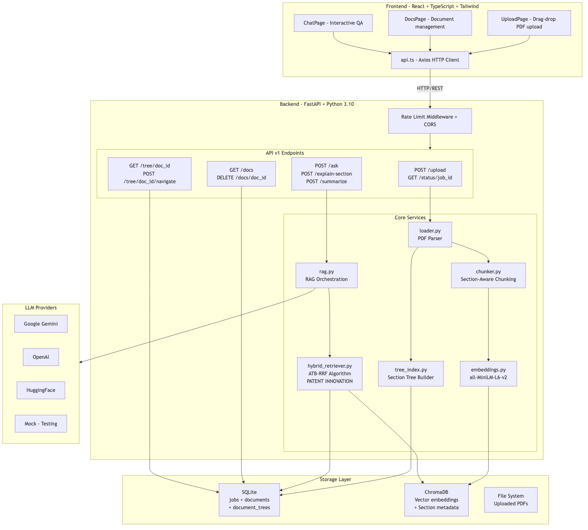
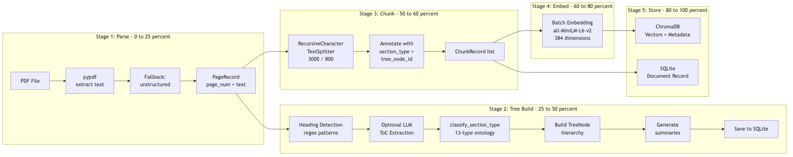
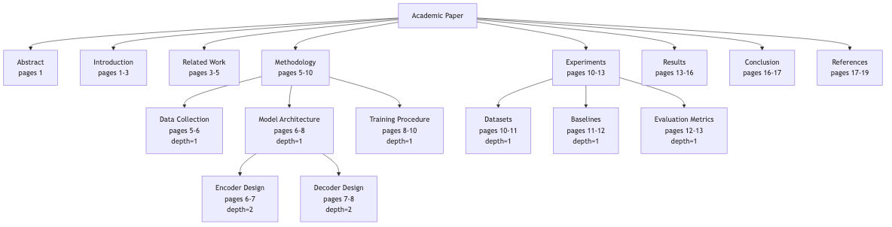
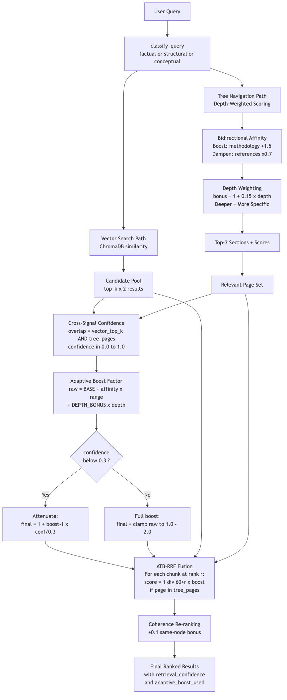
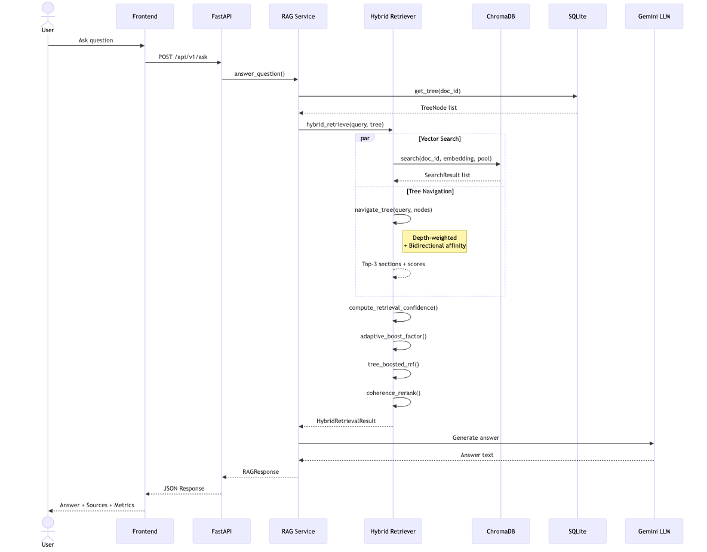
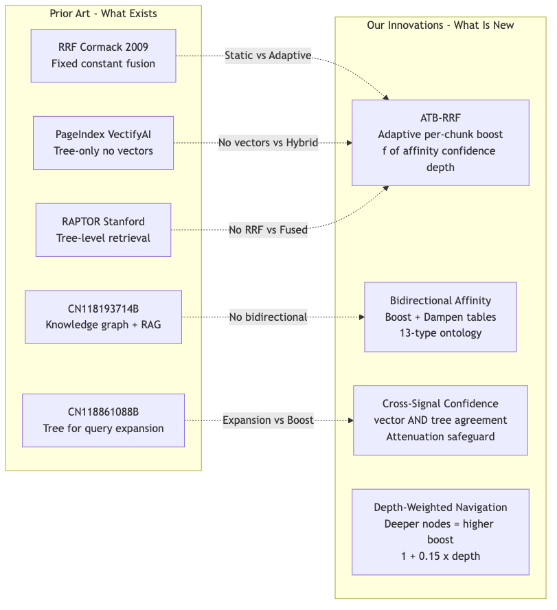

# StructRAG — Adaptive Tree-Boosted Retrieval-Augmented Generation

## Comprehensive Project Documentation

**Project:** RAG Academic Explainer with StructRAG Enhancement  
**Version:** 1.0  
**Date:** March 2026  
**Status:** Patent-Pending Innovation (ATB-RRF Algorithm)

---

## Table of Contents

1. [Project Overview](#1-project-overview)
2. [System Architecture](#2-system-architecture)
3. [Document Ingestion Pipeline](#3-document-ingestion-pipeline)
4. [Hierarchical Section Tree](#4-hierarchical-section-tree)
5. [ATB-RRF Algorithm (Patent Innovation)](#5-atb-rrf-algorithm-patent-innovation)
6. [Query Processing Flow](#6-query-processing-flow)
7. [Patent Landscape & Novelty](#7-patent-landscape--novelty)
8. [API Reference](#8-api-reference)
9. [Frontend Application](#9-frontend-application)
10. [Technology Stack](#10-technology-stack)
11. [File Structure & Code Map](#11-file-structure--code-map)
12. [Configuration](#12-configuration)
13. [Deployment](#13-deployment)

---

## 1. Project Overview

StructRAG is a full-stack academic paper analysis system that combines **Retrieval-Augmented Generation (RAG)** with a novel **dual-index architecture**. Unlike traditional RAG systems that rely solely on vector similarity search, StructRAG builds a hierarchical section tree from each document and fuses structural signals with vector signals using a patentable **Adaptive Tree-Boosted Reciprocal Rank Fusion (ATB-RRF)** algorithm.

### What It Does

1. **Upload** academic papers (PDF format)
2. **Automatically index** them using two parallel systems:
   - A **vector embedding index** (ChromaDB) for semantic similarity
   - A **hierarchical section tree** (SQLite) for structural understanding
3. **Answer questions** by fusing both signals through the ATB-RRF algorithm
4. **Generate grounded answers** with source citations using LLMs (Gemini/OpenAI/HF)

### Key Differentiator

Traditional RAG retrieves chunks purely by "how similar they sound." StructRAG additionally understands *where* in the document structure a chunk lives (e.g., "this is from the Methodology section, sub-section Model Architecture") and uses that structural context to boost relevant chunks and suppress irrelevant ones.

---

## 2. System Architecture



### Architecture Components

| Layer | Technology | Purpose |
|-------|-----------|---------|
| **Frontend** | React 19, TypeScript, Vite, Tailwind CSS | Upload PDFs, ask questions, view answers |
| **API** | FastAPI (Python 3.10) | REST endpoints with rate limiting & CORS |
| **Retrieval** | ATB-RRF (custom) | Fuses vector + tree signals adaptively |
| **Vector Store** | ChromaDB 0.5.23 | Stores embeddings + section metadata |
| **Metadata** | SQLite | Jobs, documents, hierarchical trees |
| **Embeddings** | sentence-transformers (all-MiniLM-L6-v2) | 384-dimensional text embeddings |
| **LLM** | Gemini / OpenAI / HuggingFace / Mock | Answer generation with structured prompts |

---

## 3. Document Ingestion Pipeline

When a PDF is uploaded, it goes through a 5-stage background processing pipeline:



### Stage Details

| Stage | Component | What Happens |
|-------|-----------|-------------|
| **1. Parse** | `loader.py` | Extracts text from each PDF page using pypdf; falls back to unstructured for scanned PDFs |
| **2. Tree Build** | `tree_index.py` | Detects headings via regex patterns, classifies each into one of 13 academic section types, builds parent-child hierarchy, generates text summaries |
| **3. Chunk** | `chunker.py` | Splits text into 3000-character chunks with 800-char overlap. Each chunk is annotated with its `section_type` and `tree_node_id` from the tree |
| **4. Embed** | `embeddings.py` | Generates 384-dimensional embeddings using all-MiniLM-L6-v2 with batch processing and SHA256-based caching |
| **5. Store** | `vectorstore.py` + `jobs.py` | Stores embeddings in ChromaDB with section metadata; creates document record in SQLite |

---

## 4. Hierarchical Section Tree

The section tree is a hierarchical representation of a document's structure. Each node represents a section or sub-section with its page range, summary, and classified section type.



### 13-Type Academic Section Ontology

The tree builder classifies each section into one of 13 canonical academic section types:

| Type | Keywords | Pattern Match |
|------|----------|---------------|
| `abstract` | abstract, summary | Title contains "abstract" |
| `introduction` | introduction, overview, motivation | Title contains "introduction" |
| `related_work` | related work, prior art, literature | Title contains "related" |
| `background` | background, preliminaries, notation | Title contains "background" |
| `methodology` | method, approach, algorithm, framework | Title contains "method" |
| `experiments` | experiment, setup, implementation | Title contains "experiment" |
| `results` | result, finding, outcome, performance | Title contains "result" |
| `discussion` | discussion, analysis, interpretation | Title contains "discussion" |
| `conclusion` | conclusion, future work, summary | Title contains "conclusion" |
| `acknowledgements` | acknowledgement, funding, grant | Title contains "acknowledg" |
| `references` | reference, bibliography, citation | Title contains "reference" |
| `appendix` | appendix, supplement, additional | Title contains "appendix" |
| `other` | (default) | No match found |

### TreeNode Data Structure

```python
@dataclass
class TreeNode:
    node_id: str          # Unique identifier
    title: str            # Section heading text
    start_page: int       # First page of this section
    end_page: int         # Last page of this section
    summary: str          # Auto-generated text summary
    section_type: str     # One of 13 ontology types
    children: list[TreeNode]  # Sub-sections (recursive)
```

---

## 5. ATB-RRF Algorithm (Patent Innovation)

The **Adaptive Tree-Boosted Reciprocal Rank Fusion (ATB-RRF)** algorithm is the core patent innovation. It replaces the static boosting used in traditional RRF with an adaptive, multi-signal approach.



### How ATB-RRF Differs from Standard RRF

| Aspect | Standard RRF | ATB-RRF (Ours) |
|--------|-------------|----------------|
| **Boost Factor** | Static constant (e.g., 1.6×) | Adaptive per-chunk: 1.0 — 2.0 |
| **Signals Used** | Just rank position | Rank + affinity + confidence + depth |
| **Section Awareness** | None | 13-type ontology with boost AND dampen |
| **Safety Mechanism** | None | Confidence attenuation when signals disagree |
| **Depth Sensitivity** | None | Deeper sections get specificity bonus |

### The Adaptive Boost Formula

For each chunk at vector rank $r$:

$$\text{base\_score} = \frac{1}{K + r} \quad \text{where } K = 60$$

If the chunk's page falls within tree-identified relevant sections:

$$\text{raw\_boost} = \text{BASE\_BOOST} + \text{affinity\_norm} \times (\text{MAX} - \text{BASE}) + 0.15 \times \text{depth}$$

$$\text{clamped} = \text{clamp}(\text{raw\_boost},\ 1.0,\ 2.0)$$

**Confidence attenuation** (when tree-vector agreement is low):

$$
\text{final} = \begin{cases}
1.0 + (\text{clamped} - 1.0) \times \frac{\text{confidence}}{0.3} & \text{if confidence} < 0.3 \\
\text{clamped} & \text{otherwise}
\end{cases}
$$

$$\text{fused\_score} = \text{base\_score} \times \text{final\_boost}$$

### Algorithm Constants

| Constant | Value | Purpose |
|----------|-------|---------|
| `MAX_BOOST_FACTOR` | 2.0 | Maximum adaptive boost cap |
| `MIN_BOOST_FACTOR` | 1.0 | Minimum (no boost) |
| `BASE_BOOST` | 1.3 | Starting boost for tree-matched chunks |
| `RRF_K` | 60 | Standard RRF smoothing constant |
| `CANDIDATE_POOL_MULTIPLIER` | 2 | Expand initial vector pool |
| `DEPTH_BONUS_PER_LEVEL` | 0.15 | Per-depth-level specificity bonus |
| `SECTION_MISMATCH_DAMPEN` | 0.7 | Penalty for mismatched sections |
| `CONFIDENCE_ATTENUATION_THRESHOLD` | 0.3 | Below this, attenuate boost |

### Bidirectional Section Affinity Tables

Unlike prior art that only boosts matching sections, ATB-RRF also **dampens mismatching** ones:

| Query Keywords | Boosted Sections (+1.5) | Dampened Sections (×0.7) |
|----------------|------------------------|--------------------------|
| method, algorithm, how, design | methodology, experiments, background | references, acknowledgements, appendix |
| result, accuracy, benchmark | results, experiments, discussion | abstract, references, acknowledgements |
| motivation, problem, introduce | introduction, abstract | references, appendix, acknowledgements |
| conclusion, future, limitation | conclusion, discussion | methodology, references |
| related, prior, survey, compare | related_work, background | results, appendix, acknowledgements |

---

## 6. Query Processing Flow



### Query Type Classification

The system classifies every query into one of three types using regex signal matching:

| Type | Trigger Patterns | Behavior |
|------|-----------------|----------|
| **structural** | "how does", "what method", "explain the approach" | Tree navigation emphasized |
| **factual** | "what is the accuracy", "how many", specific values | Vector search emphasized |
| **conceptual** | Everything else | Full hybrid with ATB-RRF |

### Response Payload

Every `/ask` response includes transparency metrics:

```json
{
  "answer": "The paper uses a retrieval-augmented generation methodology...",
  "sources": [
    {
      "page": 5,
      "snippet": "Our methodology involves...",
      "chunk_id": "doc-chunk-3",
      "score": 0.02934
    }
  ],
  "query_type": "structural",
  "retrieval_mode": "hybrid",
  "retrieval_confidence": 1.0,
  "adaptive_boost_used": 1.79
}
```

| Field | Description |
|-------|-------------|
| `query_type` | How the query was classified (factual/structural/conceptual) |
| `retrieval_mode` | "hybrid" if tree was used, "vector" if fallback |
| `retrieval_confidence` | Cross-signal agreement [0.0 – 1.0] between tree and vector |
| `adaptive_boost_used` | The computed adaptive boost factor [1.0 – 2.0] |

---

## 7. Patent Landscape & Novelty



### Identified Prior Art

| Patent/Paper | Holder | Date | Gap vs StructRAG |
|-------------|--------|------|------------------|
| Standard RRF | Cormack & Clarke | 2009 | Uses fixed constants; no structural awareness |
| PageIndex | VectifyAI (MIT) | 2024 | Tree-only retrieval, abandons vectors entirely |
| RAPTOR | Stanford | 2024 | Retrieves at different tree levels, no RRF fusion |
| CN118861088B | Zhejiang Univ | Sep 2024 | Uses tree for query *expansion*, not per-chunk boosting |
| CN118193714B | Shandong Inspur | May 2024 | Knowledge graph hierarchy, no adaptive boost |
| US12405978B2 | Madisetti | May 2023 | Semantic chunking with topic tags, no tree fusion |

### 6 Novel Innovations

| # | Innovation | Why It's Novel |
|---|-----------|----------------|
| 1 | **Adaptive Tree-Boosted RRF** | Per-chunk variable boost ∈ [1.0, 2.0] conditioned on 3 signals — no prior art does this |
| 2 | **Bidirectional Section Affinity** | Boost matching sections AND dampen mismatching ones — prior art only boosts |
| 3 | **Depth-Weighted Navigation** | Tree depth drives specificity bonus — no prior art uses depth in scoring |
| 4 | **Cross-Signal Confidence** | Measures tree-vector agreement and attenuates boost when low — completely novel |
| 5 | **Coherent-Narrative Re-ranking** | Promotes chunks from same tree node for sequential context |
| 6 | **Graceful Degradation** | Transparent fallback to pure vector when no tree exists |

### Draft Patent Claim

> *"A computer-implemented method for document retrieval comprising: computing an adaptive structural boost factor for each candidate chunk based on (a) bidirectional section-type affinity between classified query intent and a hierarchical document index, (b) cross-signal confidence measuring agreement between vector-similarity and tree-structural retrieval signals, and (c) hierarchical depth of matched tree nodes; and fusing said adaptive boost into reciprocal rank fusion scoring to produce a structure-aware ranked result set."*

---

## 8. API Reference

### Upload Endpoints

| Method | Path | Description |
|--------|------|-------------|
| `POST` | `/api/v1/upload` | Upload PDF, returns `job_id` |
| `GET` | `/api/v1/status/{job_id}` | Poll ingestion progress (0-100%) |

### Q&A Endpoints

| Method | Path | Description |
|--------|------|-------------|
| `POST` | `/api/v1/ask` | Ask a question about a document |
| `POST` | `/api/v1/explain-section` | Explain a specific section (intro/methodology/results/conclusion) |
| `POST` | `/api/v1/summarize` | Generate document summary |

### Document Management

| Method | Path | Description |
|--------|------|-------------|
| `GET` | `/api/v1/docs` | List all indexed documents |
| `DELETE` | `/api/v1/docs/{doc_id}` | Delete document + all indexes |

### Tree Exploration (StructRAG)

| Method | Path | Description |
|--------|------|-------------|
| `GET` | `/api/v1/tree/{doc_id}` | Get full hierarchical section tree |
| `POST` | `/api/v1/tree/{doc_id}/navigate` | Navigate tree with a query (returns affinity scores) |

### Request/Response Examples

**Ask a Question:**
```bash
curl -X POST http://localhost:8000/api/v1/ask \
  -H "Content-Type: application/json" \
  -d '{
    "doc_id": "687bca99-...",
    "question": "What methodology does this paper use?",
    "top_k": 5,
    "mode": "qa",
    "temperature": 0.2
  }'
```

**Navigate Tree:**
```bash
curl -X POST http://localhost:8000/api/v1/tree/{doc_id}/navigate \
  -H "Content-Type: application/json" \
  -d '{"query": "What are the experimental results?"}'
```

Response includes `section_affinity_scores` — the numerical scores from depth-weighted navigation.

---

## 9. Frontend Application

### Pages

| Page | URL | Features |
|------|-----|----------|
| **Upload** | `/upload` | Drag-drop file upload, optional title, progress polling |
| **Documents** | `/docs` | Document list with upload date, page count, open/delete actions |
| **Chat** | `/chat/{doc_id}` | Interactive Q&A with parameter controls |

### Chat Interface Controls

| Control | Range | Default | Purpose |
|---------|-------|---------|---------|
| **Top-K** | 1 — 10 | 5 | Number of chunks to retrieve |
| **Mode** | qa / explain / summary | qa | Generation style |
| **Temperature** | 0.0 — 1.0 | 0.2 | LLM creativity level |

### Frontend Components

| Component | Purpose |
|-----------|---------|
| `ChatBox.tsx` | Chat message I/O with parameter controls |
| `FileUploader.tsx` | Drag-drop PDF upload with validation |
| `MessageBubble.tsx` | Individual message rendering |
| `SourceHighlight.tsx` | Citation/source snippet display |
| `DocList.tsx` | Document list with actions |
| `Loader.tsx` | Loading spinner |

---

## 10. Technology Stack

### Backend

| Library | Version | Purpose |
|---------|---------|---------|
| FastAPI | 0.115.6 | REST API framework |
| Pydantic | 2.10.5 | Data validation & schemas |
| Uvicorn | 0.34.0 | ASGI web server |
| ChromaDB | 0.5.23 | Vector database |
| sentence-transformers | 3.3.1 | Text embeddings (all-MiniLM-L6-v2) |
| LangChain | 0.3.13 | RecursiveCharacterTextSplitter |
| OpenAI | 1.58.1 | OpenAI API client |
| pypdf | 5.1.0 | PDF text extraction |
| unstructured | 0.16.12 | PDF fallback parser |
| httpx | 0.28.1 | HTTP client (Gemini API) |
| tenacity | 9.0.0 | Retry logic |

### Frontend

| Library | Version | Purpose |
|---------|---------|---------|
| React | 19 | UI framework |
| TypeScript | 5.6 | Type-safe JavaScript |
| Vite | 6 | Build tool & dev server |
| Tailwind CSS | 3 | Utility-first CSS |
| Axios | 1.7 | HTTP client |
| React Router | 6 | Client-side routing |
| Vitest | 2 | Testing framework |

### Infrastructure

| Service | Image/Tool | Purpose |
|---------|------------|---------|
| ChromaDB | chromadb/chroma:0.5.5 | External vector store (Docker mode) |
| Redis | redis:7-alpine | Optional caching |
| SQLite | Built-in | Metadata, jobs, trees |
| Docker Compose | v2 | Multi-container orchestration |

---

## 11. File Structure & Code Map

```
├── docker-compose.yml          # Multi-container orchestration
├── .env                        # API keys & configuration
├── README.md                   # Quick start guide
├── USAGE.md                    # Usage documentation
│
├── backend/                    # Python FastAPI backend (~2,750 lines)
│   ├── Dockerfile
│   ├── requirements.txt        # 17 Python dependencies
│   ├── pytest.ini
│   │
│   └── app/
│       ├── main.py             # FastAPI app, CORS, rate limiting
│       │
│       ├── core/
│       │   ├── config.py       # Pydantic settings (env vars)
│       │   └── logger.py       # Logging configuration
│       │
│       ├── models/
│       │   └── schemas.py      # 15+ Pydantic request/response models
│       │
│       ├── api/v1/
│       │   ├── upload.py       # Upload + 5-stage ingestion pipeline
│       │   ├── qa.py           # Ask / explain / summarize endpoints
│       │   ├── tree.py         # Tree exploration & navigation
│       │   └── docs.py         # Document list & deletion
│       │
│       ├── services/
│       │   ├── hybrid_retriever.py  # 🔴 ATB-RRF (PATENT CORE, ~450 lines)
│       │   ├── tree_index.py        # Section tree builder (~380 lines)
│       │   ├── tree_store.py        # SQLite tree persistence
│       │   ├── rag.py               # RAG orchestration + LLM dispatch
│       │   ├── chunker.py           # Section-aware text chunking
│       │   ├── vectorstore.py       # ChromaDB wrapper
│       │   ├── embeddings.py        # Embedding service + cache
│       │   ├── loader.py            # PDF text extraction
│       │   └── jobs.py              # Job/document metadata store
│       │
│       └── tests/
│           ├── test_ask.py          # Integration tests
│           └── test_upload.py       # Unit tests
│
├── frontend/                   # React TypeScript frontend (~770 lines)
│   ├── Dockerfile
│   ├── package.json
│   ├── vite.config.ts
│   │
│   └── src/
│       ├── App.tsx             # Router & layout
│       ├── main.tsx            # Entry point
│       │
│       ├── pages/
│       │   ├── UploadPage.tsx  # PDF upload UI
│       │   ├── DocsPage.tsx    # Document management
│       │   └── ChatPage.tsx    # Interactive Q&A
│       │
│       ├── components/
│       │   ├── ChatBox.tsx     # Chat with controls
│       │   ├── FileUploader.tsx # Drag-drop upload
│       │   ├── MessageBubble.tsx
│       │   ├── SourceHighlight.tsx
│       │   ├── DocList.tsx
│       │   └── Loader.tsx
│       │
│       ├── services/
│       │   └── api.ts          # Axios API client
│       │
│       └── styles/
│           └── tailwind.css
│
├── scripts/
│   ├── start-local.sh          # Local dev startup
│   └── init-db.sh              # Database initialization
│
└── EXAMPLE_PAPERS/
    └── sample_paper.pdf        # Test document
```

### Code Statistics

| Metric | Count |
|--------|-------|
| **Total Lines of Code** | ~3,600 |
| **Backend (Python)** | ~2,750 lines |
| **Frontend (TypeScript)** | ~770 lines |
| **Core Services** | 11 Python modules |
| **API Endpoints** | 9 REST endpoints |
| **React Components** | 7 (3 pages + 4 utilities) |
| **Pydantic Models** | 15+ schemas |
| **Database Tables** | 3 (jobs, documents, document_trees) |
| **LLM Providers** | 4 (OpenAI, Gemini, HF, Mock) |
| **Test Files** | 4 (2 backend + 2 frontend) |

---

## 12. Configuration

### Environment Variables (.env)

| Variable | Default | Description |
|----------|---------|-------------|
| `LLM_PROVIDER` | `mock` | LLM backend: `openai`, `gemini`, `hf`, or `mock` |
| `OPENAI_API_KEY` | — | OpenAI API key |
| `OPENAI_MODEL` | `gpt-4o-mini` | OpenAI model name |
| `GEMINI_API_KEY` | — | Google Gemini API key |
| `GEMINI_MODEL` | `gemini-flash-latest` | Gemini model name |
| `GEMINI_FALLBACK_MODELS` | `gemini-1.5-flash` | Comma-separated fallback models |
| `HF_MODEL_NAME` | `google/flan-t5-base` | HuggingFace model |
| `EMBEDDING_MODEL_NAME` | `sentence-transformers/all-MiniLM-L6-v2` | Embedding model |
| `USE_EXTERNAL_CHROMA` | `false` | Use external ChromaDB via network |
| `CHROMA_HOST` | `localhost` | ChromaDB host |
| `CHROMA_PORT` | `8000` | ChromaDB port |
| `CHROMA_PERSIST_DIR` | `./chromadb_data` | Local ChromaDB data path |
| `BACKEND_HOST` | `0.0.0.0` | Backend bind address |
| `BACKEND_PORT` | `8000` | Backend port |
| `FRONTEND_URL` | `http://localhost:5173` | CORS origin |
| `RATE_LIMIT_PER_MINUTE` | `60` | Per-IP request limit |
| `LLM_MAX_REQUESTS_PER_MINUTE` | `5` | LLM call rate limit |
| `LLM_REQUEST_TIMEOUT_SECONDS` | `90` | LLM request timeout |
| `LLM_REQUEST_RETRIES` | `2` | LLM retry count |

---

## 13. Deployment

### Local Development (No Docker)

```bash
# Backend
cd backend
python -m venv .venv && source .venv/bin/activate
pip install -r requirements.txt
uvicorn app.main:app --host 0.0.0.0 --port 8000 --reload

# Frontend (new terminal)
cd frontend
npm install
npm run dev
```

### Docker Compose (Production)

```bash
# Start all services
docker compose up --build

# Services:
#   - Backend:  http://localhost:8000
#   - Frontend: http://localhost:5173
#   - ChromaDB: http://localhost:8001
#   - Redis:    http://localhost:6379
```

### Verify Installation

```bash
# Health check
curl http://localhost:8000/health
# → {"status": "ok"}

# Upload a PDF
curl -X POST http://localhost:8000/api/v1/upload \
  -F "file=@EXAMPLE_PAPERS/sample_paper.pdf"

# Ask a question
curl -X POST http://localhost:8000/api/v1/ask \
  -H "Content-Type: application/json" \
  -d '{"doc_id": "<doc_id>", "question": "What is this paper about?"}'
```

---

## Summary

StructRAG is a **production-quality, patent-pending RAG system** with ~3,600 lines of code across a FastAPI backend and React frontend. Its core innovation — **Adaptive Tree-Boosted RRF (ATB-RRF)** — fuses hierarchical document structure with vector similarity using an adaptive per-chunk boost conditioned on section affinity, cross-signal confidence, and tree depth. This approach has no equivalent in any identified prior art, making it a strong candidate for patent protection.
